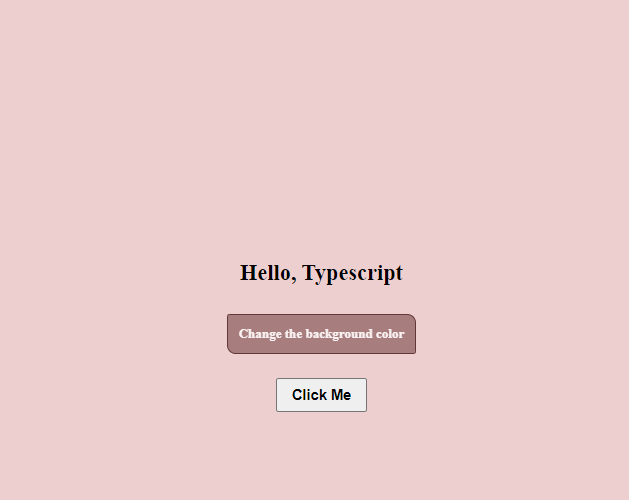

## Node js version && Installation 

v22.1.0 

**https://nodejs.org/en/download/package-manager/current**

# verifies the right Node.js version is in the environment
node -v # should print `v22.2.0`

## TypeScript Version

Version 5.4.5
I have created this project on latest verion.
# installs via npm
npm install typescript@5.4.5

# Project Setup 

**Project Setup :**  git clone 

**Run typescript :** npm start

**Check output file by running :** Click on the url generated by above command 
